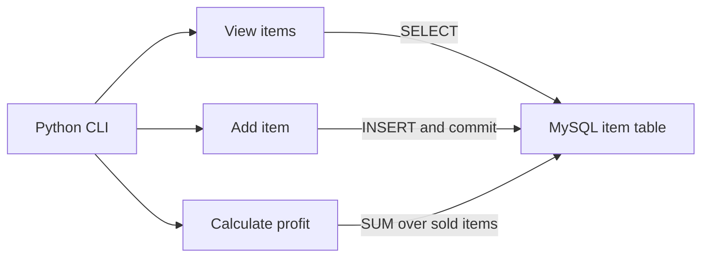

# Python / RDS Inventory CLI

A Python command-line application for tracking collectible purchases and sales
with MySQL. It began as my CIS 2368 coursework at the University of Houston.
This repository is a separate copy for documentation and future improvements.

**Author:** Gerardo Vera  
**Status:** Coursework implementation copied; portfolio documentation in progress.
Live database verification, screenshots, and a video demonstration are pending.

## What it does

| Command | Action |
| --- | --- |
| `iv` | View saved items, including items that have not sold |
| `ia` | Add a purchase date, purchase price, and optional sale price |
| `ic` | Calculate total profit from items with a sale price |
| `q` | Quit and close the database connection |

The program rejects invalid date/price formats and negative prices. Database
errors are displayed in the console. It does not provide editing, deleting,
user accounts, a graphical interface, or a separate total-sales command.

## Project background and contribution

The coursework task used a Python menu and an AWS RDS MySQL database. I used
ChatGPT for connection troubleshooting, SQL suggestions, menu/functions, and
debugging, as recorded in my original disclosure. See [AI assistance](ai_use.txt).

The copied implementation is the starting point, not a new independently
designed cloud system. Changes in this personal copy include environment-based
configuration, an import guard for offline testing, a separate default database
name, and the documentation below. Those changes were prepared with Codex.

## How the pieces connect

| Component | Role |
| --- | --- |
| Python | Menu, input handling, and output |
| MySQL Connector/Python | Connection, parameterized inserts, and queries |
| MySQL | Stores item records and calculates the profit aggregate |
| AWS RDS | Database hosting used for the original coursework |

The personal copy can target an authorized MySQL server, including RDS. Creating
an RDS instance, configuring a VPC, and provisioning infrastructure are not
automated by this repository. See [schema and behavior](docs/architecture.md).

## Run it

1. Install the dependency: `py -m pip install -r requirements.txt`.
2. Create the separate `inventory_portfolio` database using `database_setup.sql`.
3. Set the database environment variables described in [setup](docs/setup.md).
4. Run `py main_code.py`.

Use `python` instead of `py` on macOS/Linux. Use a database you control for this
copy, rather than the original class database. The setup guide includes the
Windows PowerShell commands and optional certificate verification settings.

## Evidence and verification

| Evidence | Current status |
| --- | --- |
| Implementation and sample SQL | Available in this repository |
| Offline application checks | [Check results](docs/verification.md) |
| Actual CLI/database screenshots | Pending |
| MySQL/RDS integration checks | Pending |
| Video walkthrough | Planned; no video available yet |

[Evidence checklist](docs/evidence.md) explains what to capture and what each
image should prove. Add actual screenshots beside their explanations when
available. No simulated database screenshots are used as evidence here.

## Decisions worth explaining

- **Unsold items:** a missing sale price is stored as SQL `NULL` and displayed
  as `Not sold`. The profit query excludes those rows.
- **Insert parameters:** values are passed separately from the SQL statement,
  rather than assembled into the SQL string.
- **Persistence:** the add operation commits the insert. A database-backed
  restart/persistence check still needs to be recorded.
- **Configuration in the copy:** credentials are read from process environment
  variables. Real credentials and original Git history were not copied.

## Limitations and next steps

This is a small coursework application. Python parses prices with `float`, even
though MySQL stores them as `DECIMAL`. Non-finite numeric input needs stronger
validation. There is no rollback/retry strategy, and SQL-error cursor cleanup
could be improved. Certificate and hostname verification are enabled only when
`DB_SSL_CA` is configured; no successful TLS connection is claimed here.

Next steps are to verify it against a separate MySQL database, add genuine
screenshots and a short video, and then address the input/error-handling gaps.
Those improvements are plans, not completed features.

## Origin

Snapshot copied on October 3, 2026 from the private coursework repository
`CIS-UH/cis2368-fa26-homework-1-luckyyy-y`, branch `main`, commit
`07d03ce0d76cb3b78b5cbc0bbbbc8365a92c6f9f`.
This is an independent repository, not a fork or a replacement submission.

[Setup](docs/setup.md) · [Architecture](docs/architecture.md) ·
[Troubleshooting](docs/troubleshooting.md) · [Evidence](docs/evidence.md)
