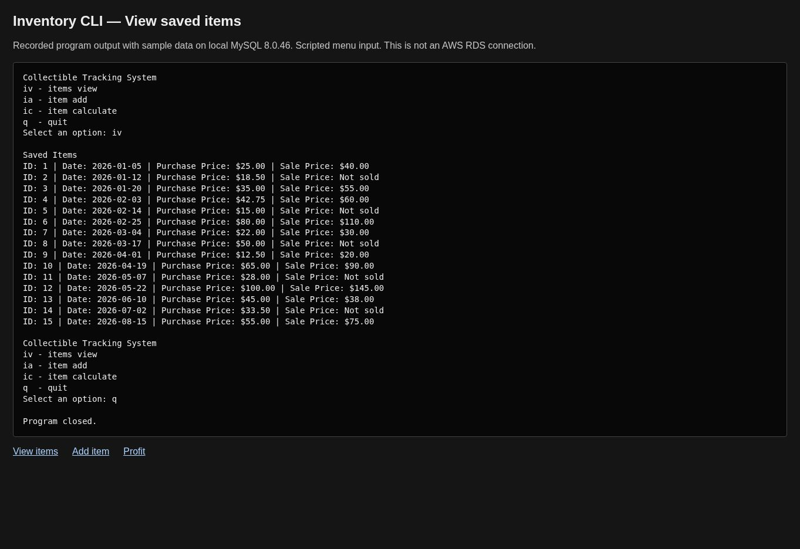
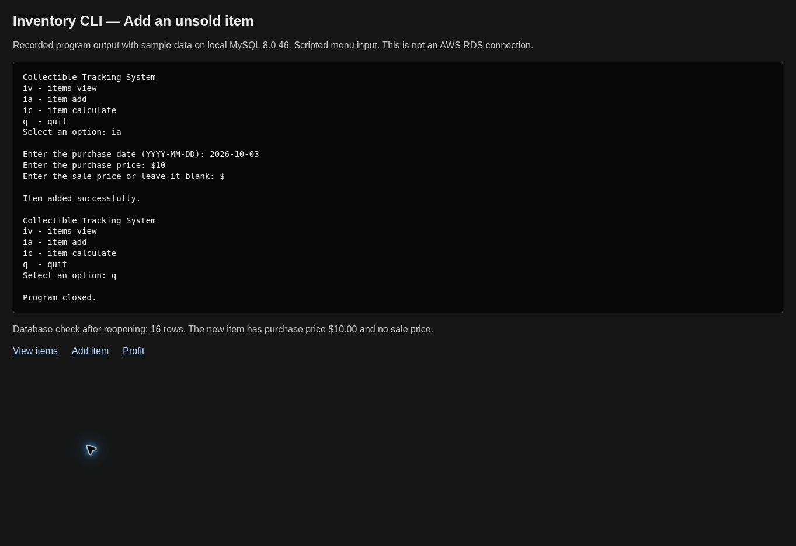
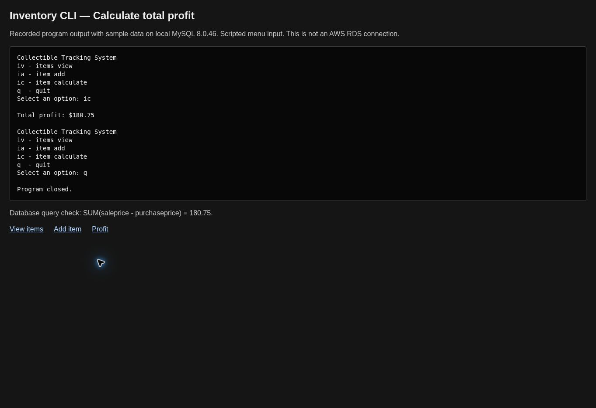

# Python / RDS Inventory

This is a small Python program for tracking purchases and sales. It started as my CIS 2368 homework at the University of Houston.

This repository is my separate personal copy. The original class repository is unchanged. The coursework used AWS RDS; the screenshots below use a separate local MySQL database with sample data.

## Screenshots

These are screenshots of recorded program output displayed in a simple transcript page. The menu input was scripted, and the program connected to real local MySQL 8.0.46. They do not show an RDS connection.

### View items

The program displays 15 sample records. Items without a sale price show `Not sold`.



### Add an item

A sample item was added with a $10.00 purchase price and no sale price. After the program closed and reopened, the database had 16 records and the new item was still there.



### Calculate profit

The program returned $180.75. The database aggregate query returned the same amount. Unsold items are excluded.



The [saved console output](docs/captures/) includes the reopened inventory and the recorded check results.

## Menu options

| Option | What it does |
| --- | --- |
| `iv` | View items |
| `ia` | Add an item |
| `ic` | Calculate profit from sold items |
| `q` | Quit |

## Tools used

Python, MySQL Connector/Python, and MySQL. AWS RDS was the database host for the coursework. This repository does not create AWS infrastructure.

## Run it

1. Install the packages: `py -m pip install -r requirements.txt`.
2. Run `database_setup.sql` on a separate MySQL database you control.
3. Set your database environment variables using the [setup guide](docs/setup.md).
4. Run `py main_code.py`.

Use `python` instead of `py` on macOS/Linux. Running the full SQL setup again inserts another set of sample records.

## Checks

```powershell
py -m unittest discover -s tests -v
```

All 10 offline tests pass. A separate local MySQL run also checked viewing, adding, reopening, and calculating profit. An RDS connection and certificate verification are still pending. See [verification](docs/verification.md).

## Project notes

- An unsold item uses SQL `NULL` for its sale price.
- The insert uses query parameters instead of putting input into a SQL string.
- The program commits new items so they can be read after reopening.
- Connection settings come from environment variables.

The code still uses `float` for input prices. Decimal input handling and cleanup after database errors are improvements to work on. There is no edit/delete menu, login system, GUI, or separate total-sales command.

## Help used and origin

I used ChatGPT for connection troubleshooting, SQL suggestions, menu code, and debugging. See [AI assistance](ai_use.txt). Codex helped prepare this personal copy, documentation, and checks.

Copied on October 3, 2026 from my coursework repository, commit `07d03ce0d76cb3b78b5cbc0bbbbc8365a92c6f9f`. This is a separate project copy, not a replacement class submission.

[Setup](docs/setup.md) · [Architecture](docs/architecture.md) · [Troubleshooting](docs/troubleshooting.md) · [Evidence](docs/evidence.md)
